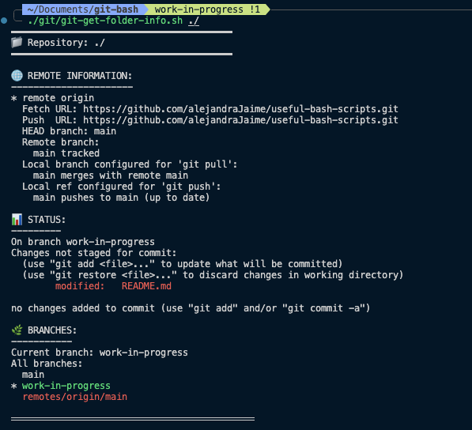

# Useful Bash Scripts

A collection of some bash scripts that do some simple things that I don't want to do manually.

## Installing & Running a script

To run any of the scripts, you need to make them executable. To do that, run the following command

```
chmod +x [./path/to/script.sh]
```

Then, to execute it, run

```
./path/to/script.sh
```

## curl-http folder

### curl-gcp-cf-user-credentials.sh

Runs a curl command that calls the http url passed in by the user and with the specific body the user passes it. The user will be prompted to input a url and a body for the request.

## Git folder

### check-repos.sh

Returns a list of all the git repos found in the path given to the script. For example:

```
./git/check-repos.sh ~/Documents
```

Returns all git repos found in the `~/Documents` folder

### get-git-repos-for-input-folder.sh

Does something similar to the previous git script. However, this one returns both the local path to the folder and the remote origin of the repository. It also requires inputing a local folder.

### get-git-folder-info.sh

Returns a quick summary of the inputed folder, which should have a repo. It returns the output of

-   The git remote url
-   The current state of the local repo, so it will show if there are any staged or modified files in whichever branch the current repo is in.
-   A list of local branches


